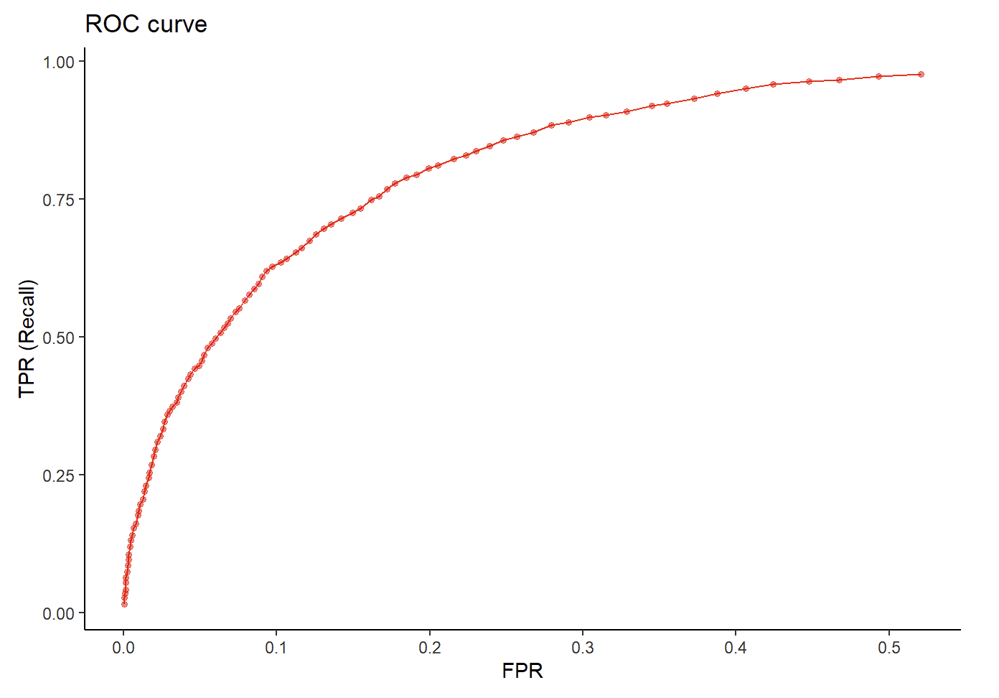
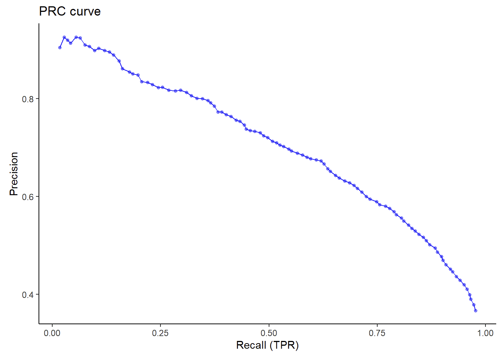

# **Package Overview**

m6APrediction — An R package for computational prediction of RNA
N6-methyladenosine (m6A) modification sites.

This package provides a user-friendly interface for identifying
potential m6A methylation sites based on sequence-derived features and
transcript-level annotations.It was developed to assist researchers in
RNA epitranscriptomics by enabling high-throughput and reproducible
prediction of m6A modifications using machine learning models.

Specifically, m6APrediction employs a Random Forest classifier trained
on experimentally validated datasets.It allows users to supply 5-mer RNA
sequences along with biological and structural features (e.g., GC
content, RNA region, exon length, evolutionary conservation) to estimate
the probability that a site contains an m6A modification.

The package includes two main functions:

-   `prediction_multiple()` — performs prediction for multiple sites
    from a feature table (batch mode).

-   `prediction_single()` — performs prediction for one sequence using
    individual feature inputs (single mode).

Together, these functions make it possible to integrate m6A prediction
into downstream RNA analysis pipelines or apply it directly to novel
datasets.

# Installation

To install m6APrediction from GitHub, you can use either the devtools or
remotes package.Both methods ensure that the package is downloaded and
compiled from the GitHub repository.

``` r
# Install devtools or remotes if not already installed

if(!requireNamespace("devtools")){
  install.packages("devtools") 
}
if(!requireNamespace("remotes")){
  install.packages("remotes")
}

# Install m6APrediction directly from GitHub
devtools::install_github("Hanqi0523/m6APrediction") 
# or equivalently 
remotes::install_github("Hanqi0523/m6APrediction")
```

After installation, you can load the package with:

``` R
library(m6APrediction)
```

This will make all exported functions (including `dna_encoding()`,
`prediction_multiple()`, and `prediction_single()`) available in your
current R session.The package automatically includes example data and a
pre-trained Random Forest model for demonstration purposes.

# Example Usage

The following example demonstrates how to use both core functions —
prediction_multiple() for batch predictions and prediction_single() for
individual site predictions.

First, we load a pre-trained model (rf_fit.rds) and a small example
dataset (m6A_input_example.csv) that come with the package.Then, we
perform both batch and single-sequence predictions to illustrate their
workflow.

``` R
library(m6APrediction)

# ---- Load pre-trained model and example input ----
rf_path <- system.file("extdata", "rf_fit.rds", package = "m6APrediction") 
csv_path <- system.file("extdata", "m6A_input_example.csv", package = "m6APrediction")

ml_fit <- readRDS(rf_path) df <- read.csv(csv_path, check.names = FALSE)

# ---- Batch prediction for multiple sites ----
# This function returns a data frame containing predicted probabilities and binary classifications
res <- prediction_multiple( ml_fit, feature_df = df, positive_threshold = 0.5 )

# Display the first few predictions
head(res[, c("DNA_5mer", "predicted_m6A_prob", "predicted_m6A_status")])

# ---- Single-sample prediction ----
# Here we manually input one RNA site and obtain its m6A probability and label
prediction_single(ml_fit, 
                  gc_content = 0.55, 
                  RNA_type = "mRNA", 
                  RNA_region = "CDS", 
                  exon_length = 1200, 
                  distance_to_junction = 45, 
                  evolutionary_conservation = 0.82, 
                  DNA_5mer = "ATCGA" )
```

# Model Performance

To showcase the model’s predictive performance, ROC and PRC curves
generated in Practical 4 are displayed below.





# License

This package is distributed under the MIT License.


